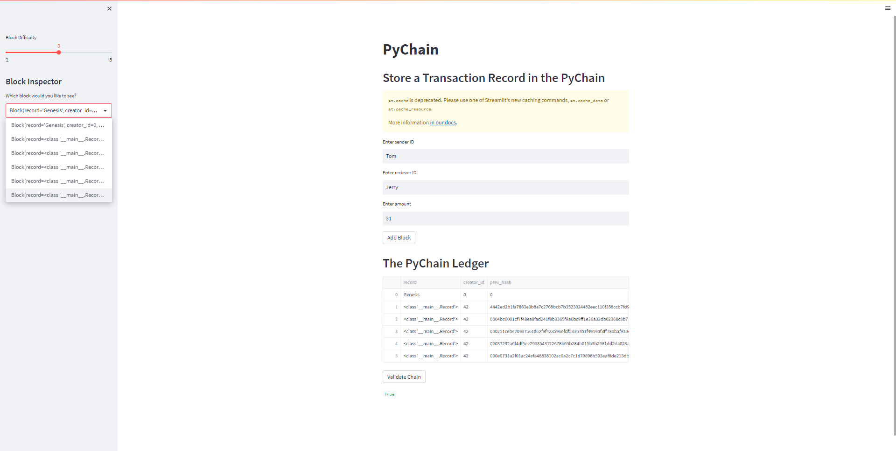
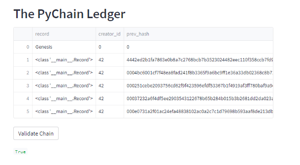

# PyChain Ledger

In this assignment, a ledger system was created to record transactions on the blockchain. This is done by taking the user input (where the user would input the sender id, receiver id, and amount) and recording them on a ledger. This can be done continuously until a chain is created as seen in the example below:

The user can also validate the chain with the click of a button. As seen in the example, here is the result:

